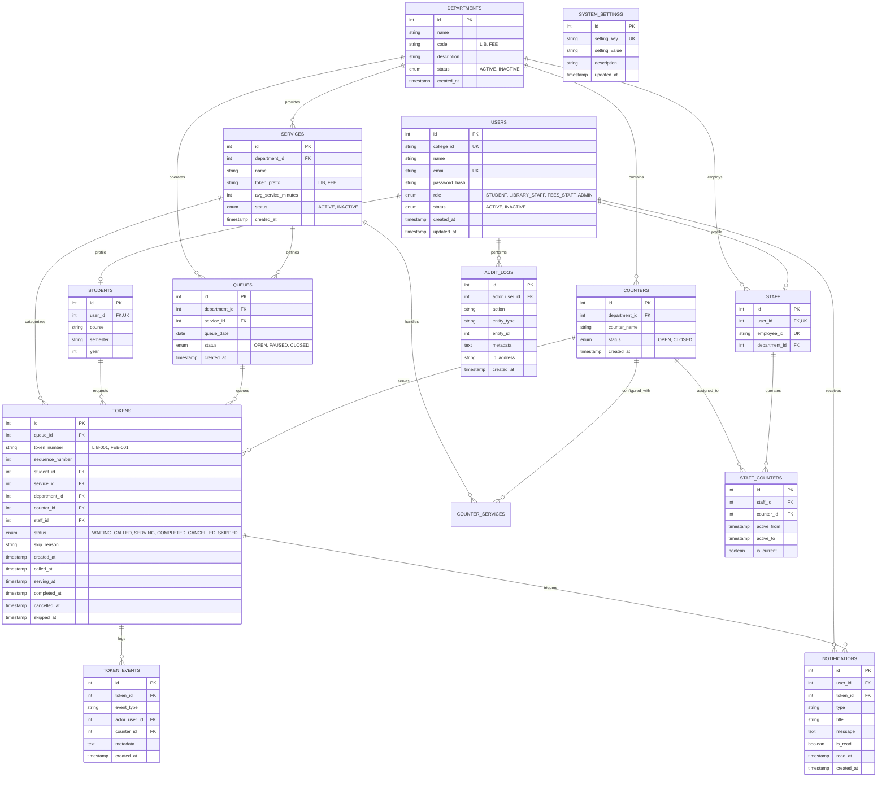

# College Queue Management System (CQMS) — Entity Relationship Diagram

```mermaid
erDiagram
    DEPARTMENTS ||--o{ SERVICES : provides
    DEPARTMENTS ||--o{ COUNTERS : contains
    DEPARTMENTS ||--o{ STAFF : employs
    DEPARTMENTS ||--o{ QUEUES : operates
    SERVICES ||--o{ QUEUES : defines
    SERVICES ||--o{ TOKENS : categorizes
    SERVICES ||--o{ COUNTER_SERVICES : handles
    COUNTERS ||--o{ COUNTER_SERVICES : configured_with
    COUNTERS ||--o{ STAFF_COUNTERS : assigned_to
    STAFF ||--o{ STAFF_COUNTERS : operates
    USERS ||--o| STUDENTS : profile
    USERS ||--o| STAFF : profile
    USERS ||--o{ NOTIFICATIONS : receives
    USERS ||--o{ AUDIT_LOGS : performs
    STUDENTS ||--o{ TOKENS : requests
    QUEUES ||--o{ TOKENS : queues
    COUNTERS ||--o{ TOKENS : serves
    TOKENS ||--o{ TOKEN_EVENTS : logs
    TOKENS ||--o{ NOTIFICATIONS : triggers

    DEPARTMENTS {
        int id PK
        string name
        string code "LIB, FEE"
        string description
        enum status "ACTIVE, INACTIVE"
        timestamp created_at
    }

    SERVICES {
        int id PK
        int department_id FK
        string name
        string token_prefix "LIB, FEE"
        int avg_service_minutes
        enum status "ACTIVE, INACTIVE"
        timestamp created_at
    }

    COUNTERS {
        int id PK
        int department_id FK
        string counter_name
        enum status "OPEN, CLOSED"
        timestamp created_at
    }

    USERS {
        int id PK
        string college_id UK
        string name
        string email UK
        string password_hash
        enum role "STUDENT, LIBRARY_STAFF, FEES_STAFF, ADMIN"
        enum status "ACTIVE, INACTIVE"
        timestamp created_at
        timestamp updated_at
    }

    STUDENTS {
        int id PK
        int user_id FK, UK
        string course
        string semester
        int year
    }

    STAFF {
        int id PK
        int user_id FK, UK
        string employee_id UK
        int department_id FK
    }

    STAFF_COUNTERS {
        int id PK
        int staff_id FK
        int counter_id FK
        timestamp active_from
        timestamp active_to
        boolean is_current
    }

    QUEUES {
        int id PK
        int department_id FK
        int service_id FK
        date queue_date
        enum status "OPEN, PAUSED, CLOSED"
        timestamp created_at
    }

    TOKENS {
        int id PK
        int queue_id FK
        string token_number "LIB-001, FEE-001"
        int sequence_number
        int student_id FK
        int service_id FK
        int department_id FK
        int counter_id FK
        int staff_id FK
        enum status "WAITING, CALLED, SERVING, COMPLETED, CANCELLED, SKIPPED"
        string skip_reason
        timestamp created_at
        timestamp called_at
        timestamp serving_at
        timestamp completed_at
        timestamp cancelled_at
        timestamp skipped_at
    }

    TOKEN_EVENTS {
        int id PK
        int token_id FK
        string event_type
        int actor_user_id FK
        int counter_id FK
        text metadata
        timestamp created_at
    }

    NOTIFICATIONS {
        int id PK
        int user_id FK
        int token_id FK
        string type
        string title
        text message
        boolean is_read
        timestamp read_at
        timestamp created_at
    }

    SYSTEM_SETTINGS {
        int id PK
        string setting_key UK
        string setting_value
        string description
        timestamp updated_at
    }

    AUDIT_LOGS {
        int id PK
        int actor_user_id FK
        string action
        string entity_type
        int entity_id
        text metadata
        string ip_address
        timestamp created_at
    }
```
